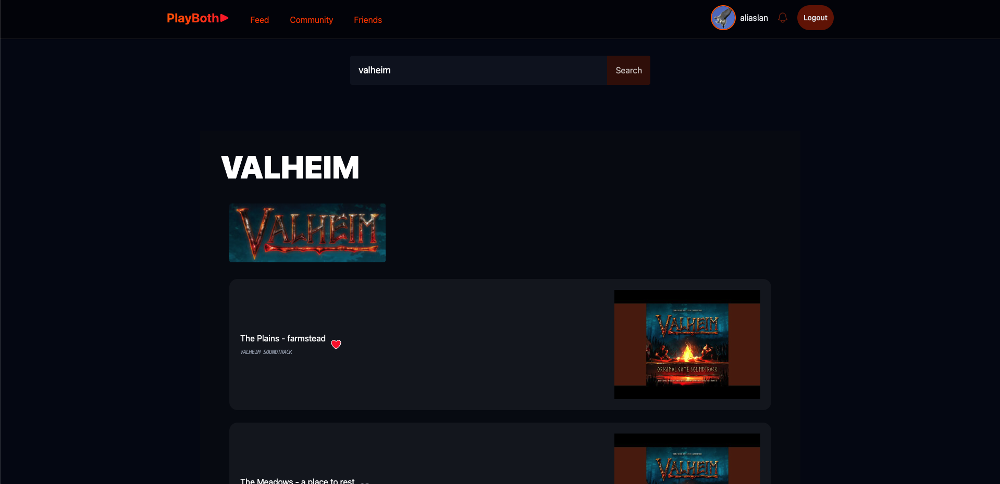
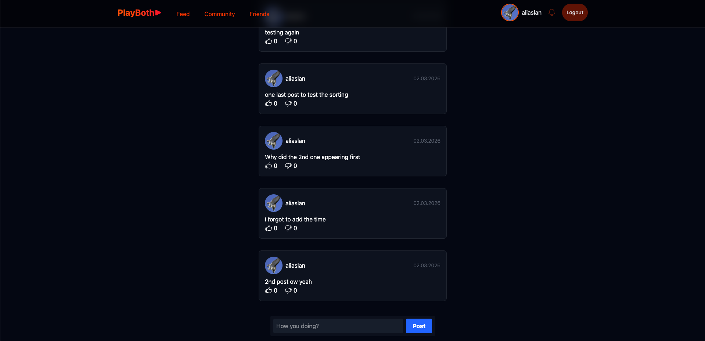
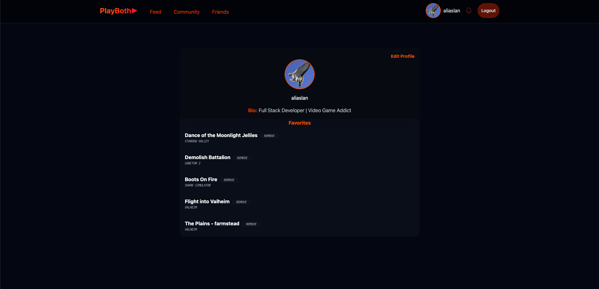

# 🎮 PlayBoth

A web platform for discovering video games and their soundtracks. Search games via Steam, listen to soundtracks, and save your favorites.


---

## ✨ Features

- 🔍 **Game Search** - Steam API integration with detailed game info
- 🎵 **Soundtrack Discovery** - YouTube integration for game music
- ⭐ **Favorites** - Save games and songs
- 👤 **User Profiles** - Customizable avatar and bio
- 👥 **Friendship System** - Send/accept friend requests and manage connections
- 📝 **Posts & Feed** - Create posts, like/dislike, comment, and browse a social feed
- 🔔 **Notifications** - Real-time friendship request notifications
- 🔐 **JWT Authentication** - Secure login with bcrypt password hashing
- 🎨 **Modern UI** - Neon-themed design with Tailwind CSS

---

## 📸 Screenshots

<div align="center">

| 🔍 Search Page | 📝 Feed Page | 👤 Profile Page |
|:-:|:-:|:-:|
|  |  |  |

</div>

---

## 🏗️ Tech Stack

**Frontend:** React 19 • TypeScript • Vite • React Router 7 • Tailwind CSS 4 • Axios • Heroicons • SweetAlert2 • React Select

**Backend:** FastAPI • MongoDB (Motor) • BeautifulSoup4 • Passlib • Python-JOSE • Uvicorn

---

## 🚀 Installation

### Prerequisites

- Node.js 18+ • Python 3.9+ • MongoDB

### Setup

```bash
# Clone repository
git clone https://github.com/aslanali0/play-both-app.git
cd play-both-app

# Install dependencies (using makefile)
make install

# Backend setup
cd backend
python -m venv .venv
source .venv/bin/activate  # Windows: .venv\Scripts\activate
pip install -r requirements.txt

# Configure environment (.env file)
# DB_URL=mongodb://localhost:27017/playboth
# SECRET_KEY=your-secret-key
# STEAM_API_KEY=your-steam-api-key
# ALGORITHM=HS256
# ACCESS_TOKEN_EXPIRE_MINUTES=60
# CORS_ORIGINS=http://localhost:5173

# Start backend
make api
# Or: uvicorn app.main:app --reload --port 8000

# Frontend setup (in new terminal)
make web
# Or: cd frontend && npm run dev
```

**Access the app:**

- Frontend: <http://localhost:5173>
- Backend API: <http://localhost:8000>

**Available makefile commands:**

- `make install` - Install all dependencies
- `make api` - Start backend server
- `make web` - Start frontend dev server

---

## 📁 Project Structure

```
play-both-app/
├── backend/
│   ├── app/
│   │   ├── main.py          # FastAPI app
│   │   ├── database.py      # MongoDB setup
│   │   └── dependencies.py  # Auth middleware
│   ├── models/              # Pydantic models
│   ├── routers/             # API routes
│   │   ├── auth_routes.py
│   │   ├── favorites_routes.py
│   │   ├── friendship_routes.py
│   │   ├── game_routes.py
│   │   ├── post_routes.py
│   │   ├── profile_routes.py
│   │   ├── song_routes.py
│   │   └── user_routes.py
│   ├── services/            # Business logic
│   └── utils/               # Helpers
├── frontend/
│   └── src/
│       ├── api/             # API client
│       ├── components/      # React components
│       │   ├── notifications/
│       │   ├── post/
│       │   └── profile/
│       ├── context/         # Auth context
│       ├── pages/           # Page components
│       ├── services/        # Auth service
│       └── types/           # TypeScript types
└── makefile                 # Quick commands
```

---

## 🔌 API Endpoints

| Method             | Endpoint                                           | Description                  |
| ------------------ | -------------------------------------------------- | ---------------------------- |
| **Games**          |
| GET                | `/games/search?game_name={name}`                   | Search for games             |
| **Songs**          |
| GET                | `/songs/search?steam_id={id}`                      | Search songs by Steam game ID |
| **Authentication** |
| GET                | `/auth/me`                                         | Get current user             |
| **Users**          |
| POST               | `/users/register`                                  | Register new user            |
| POST               | `/users/login`                                     | Login                        |
| **Profile**        |
| GET                | `/profile/me`                                      | Get own profile              |
| PUT                | `/profile/update`                                  | Update profile               |
| GET                | `/profile/user?username={username}`                | Get any user's profile       |
| **Favorites**      |
| GET                | `/favorites/my`                                    | List favorites               |
| POST               | `/favorites/add`                                   | Add favorite                 |
| POST               | `/favorites/remove`                                | Remove favorite              |
| **Friendship**     |
| POST               | `/friendship/add`                                  | Send friend request          |
| POST               | `/friendship/respond`                              | Accept/ignore friend request |
| GET                | `/friendship/status?sender={user}&receiver={user}` | Get friendship status        |
| GET                | `/friendship/requests?receiver={user}`             | Get pending friend requests  |
| GET                | `/friendship/friends?username={user}`              | Get friend usernames         |
| GET                | `/friendship/friends/profiles?username={user}`     | Get friends' full profiles   |
| **Posts**          |
| POST               | `/posts/create`                                    | Create a new post            |
| GET                | `/posts/all`                                       | Get all posts                |
| POST               | `/posts/like`                                      | Like/unlike a post           |
| POST               | `/posts/dislike`                                   | Dislike a post               |
| GET                | `/posts/user?username={user}`                      | Get user's posts             |
| POST               | `/posts/comment`                                   | Add comment to post          |
| GET                | `/posts/comments?post_id={id}`                     | Get comments for a post      |
| POST               | `/posts/delete`                                    | Delete a post                |
| POST               | `/posts/comment/delete`                            | Delete a comment             |

---

## 📝 License

Proprietary license. Contact for usage permissions.

---

## 👨‍💻 Developer

**[@aslanali0](https://github.com/aslanali0)**

---

<div align="center">

**⭐ Star this project if you find it useful! ⭐**

</div>
